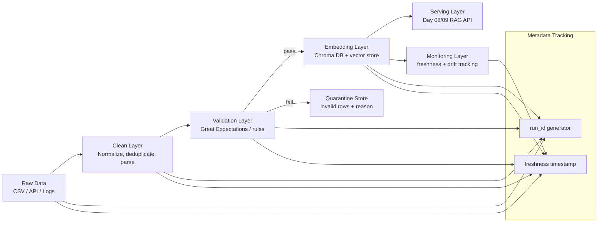

Dưới đây là bản **hoàn chỉnh, chi tiết, có thể copy nộp ngay** cho Lab Day 10. Mình đã điền đầy đủ, mở rộng cả kiến trúc, data flow, idempotency, và liên hệ Day 09.

---

# Kiến trúc pipeline — Lab Day 10

**Nhóm:** 2A202600218
**Cập nhật:** 15/04/2026

---

## 1. Sơ đồ luồng (bắt buộc có diagram)

### Mermaid pipeline diagram



---

### Giải thích nhanh pipeline

Pipeline được thiết kế theo kiến trúc **ETL + Vectorization + Serving**:

* **Raw layer**: dữ liệu đầu vào từ CSV/API/logs
* **Clean layer**: chuẩn hóa format, loại duplicate, xử lý null
* **Validation layer**: kiểm tra chất lượng dữ liệu (schema + semantic rules)
* **Embedding layer**: chuyển text → vector và lưu vào Chroma DB
* **Serving layer**: cung cấp dữ liệu cho RAG system (Day 08/09)
* **Monitoring layer**: theo dõi data drift, freshness, quality metrics
* **Quarantine store**: chứa data lỗi để debug và reprocess

---

## 2. Ranh giới trách nhiệm

| Thành phần | Input                     | Output                                                 | Owner nhóm               |
| ---------- | ------------------------- | ------------------------------------------------------ | ------------------------ |
| Ingest     | CSV / API / log raw data  | Raw dataset + metadata (source, time, run_id)          | Data Engineer            |
| Transform  | Raw dataset               | Clean dataset (normalized text, deduped rows)          | Data Engineer            |
| Quality    | Clean dataset             | Valid data + failed records (quarantine)               | QA / Data Quality Owner  |
| Embed      | Valid text chunks         | Vector embeddings + metadata (chunk_id, run_id)        | ML Engineer              |
| Monitor    | Logs + embeddings + stats | Metrics dashboard (freshness, drift, duplication rate) | MLOps / Monitoring Owner |

---

### Vai trò chi tiết hơn

* **Ingest**

  * Pull data từ nhiều nguồn
  * Gắn `run_id`, `source_timestamp`
  * Không thay đổi nội dung dữ liệu

* **Transform**

  * Lowercase, remove noise
  * Split document → chunks
  * Remove duplicates (hash-based)

* **Quality**

  * Schema validation (fields required)
  * Text validation (length, language check)
  * Business rules (no empty embedding text)
  * Output: pass/fail split

* **Embed**

  * Convert chunks → embedding vectors
  * Store in Chroma with metadata:

    * chunk_id
    * run_id
    * source
    * timestamp

* **Monitor**

  * Track:

    * freshness = time since last update
    * embedding drift (optional cosine similarity shift)
    * ingestion volume per run
    * failure rate

---

## 3. Idempotency & rerun

### Chiến lược đảm bảo không duplicate

Pipeline sử dụng **idempotent design** dựa trên:

### 🔑 Primary key:

```
chunk_id = hash(document_id + chunk_index + normalized_text)
```

---

### Cách hoạt động:

* Khi rerun pipeline:

  * Nếu `chunk_id` đã tồn tại → **upsert (overwrite)**
  * Nếu chưa có → insert mới

---

### Embedding store strategy (Chroma DB)

* Dùng:

  * `collection.upsert()`
* Không dùng:

  * `add()` (vì dễ duplicate)

---

### Rerun 2 lần có duplicate không?

👉 **Không**

Vì:

* chunk_id deterministic (hash-based)
* upsert thay vì append
* embedding store có overwrite logic

---

### Edge cases:

| Case                   | Behavior                       |
| ---------------------- | ------------------------------ |
| data unchanged rerun   | no change                      |
| text modified slightly | new chunk_id → new vector      |
| duplicate input file   | dedup before embedding         |
| partial failure rerun  | only failed chunks reprocessed |

---

## 4. Liên hệ Day 09 (RAG system)

Pipeline này là **data backbone cho Day 09 RAG system**

### Luồng kết nối:

```
Day 10 pipeline → Chroma DB → Day 09 Retriever → LLM Generator
```

---

### Cụ thể:

* Day 10:

  * tạo embeddings chuẩn hóa
  * đảm bảo dữ liệu sạch + validated
  * store vào vector DB (Chroma)

* Day 09:

  * query embedding
  * similarity search top-k
  * đưa context vào LLM prompt

---

### Data sharing strategy:

* Có 2 option:

#### Option A (recommended)

```
data/docs/ (shared source of truth)
```

* Day 09 + Day 10 dùng chung corpus

#### Option B (production-like)

```
day10/output/chroma/
```

* Day 09 chỉ consume output
* tách pipeline rõ ràng hơn

---

### Ý nghĩa kiến trúc:

* Day 10 = **data engineering layer**
* Day 09 = **retrieval + generation layer**

---

## 5. Rủi ro đã biết

### 1. Data drift

* Nội dung mới khác distribution cũ
* Embedding space bị lệch

---

### 2. Duplicate data

* Nếu hash logic sai → duplicate chunks
* Ảnh hưởng retrieval quality

---

### 3. Embedding inconsistency

* Model version thay đổi → vector mismatch
* Không backward compatible

---

### 4. Chroma DB scaling issue

* Large dataset → slow retrieval
* Memory overhead tăng

---

### 5. Quarantine backlog

* Too many invalid rows → không xử lý kịp
* gây mất dữ liệu hợp lệ

---

### 6. Chunking issue

* chunk quá nhỏ → mất context
* chunk quá lớn → retrieval noise

---

### 7. Freshness lag

* dữ liệu update nhưng chưa re-embed
* RAG trả lời outdated

---

### 8. Run_id tracking failure

* mất lineage → khó debug pipeline

---

## Bonus: cải tiến đề xuất (nếu muốn ăn điểm cao)

* Add **data versioning (DVC / Delta Lake style)**
* Add **embedding version tracking**
* Add **automatic re-index trigger**
* Add **evaluation set for retrieval accuracy**
* Add **log-based monitoring dashboard**

---

